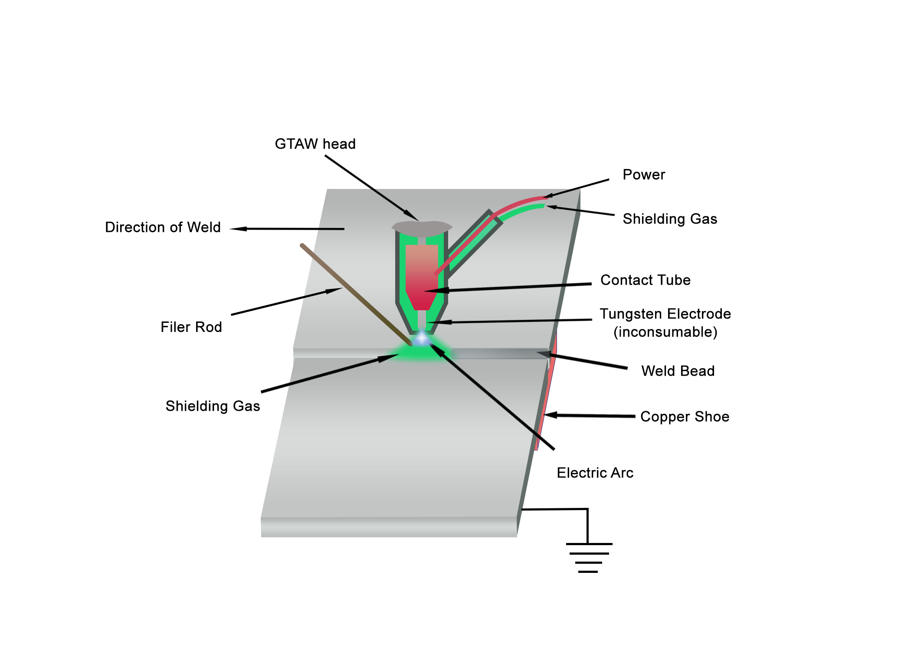
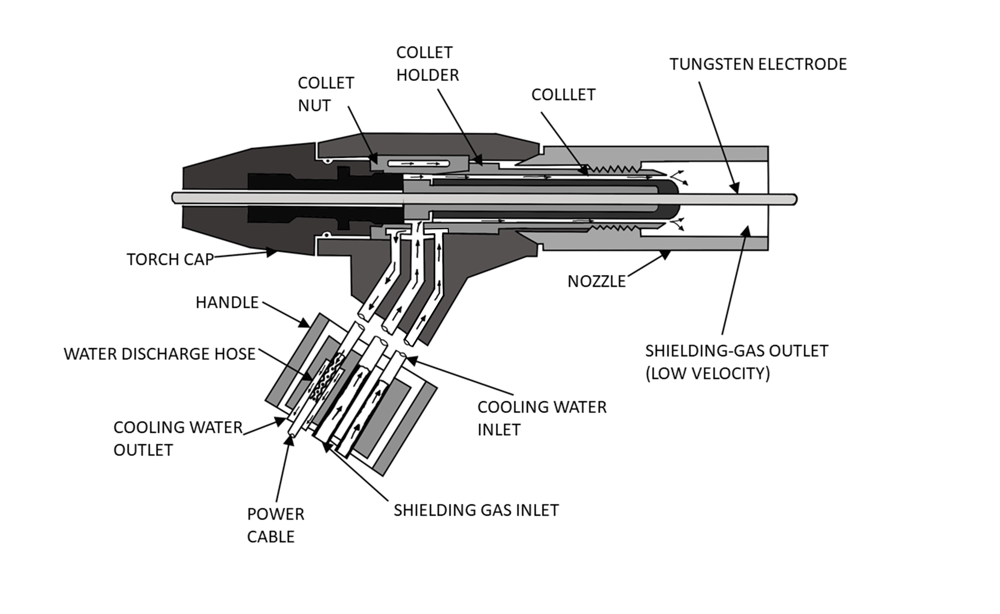

#  Introduction:
Gas Tungsten Arc Welding (GTAW) is a method of   electric arc welding process in which the energy of fusion is utilized by an electric arc between the tungsten electrode and workpiece, shielding gas is focused around the electric arc which helps in protecting the weld pool from oxidation from the atmospheric air. Shielding gas such as Ar, He and CO2 is focused to the weld pool through a gas nozzle. GTAW is distinct from Metal Inert Gas and Manual Metal Arc welding because the electrode is non-consumable in GTAW and uses filler wire from external source as shown in Figure 1. GTAW can be done with or without filler material. GTAW without filler material is called autogenous welding.

***Figure 1. Gas Tungsten Arc Welding***

# Theory

## Gas Tungsten Arc Welding equipment

The GTAW equipment chiefly consists of:

- GTAW torch used to control the arc.
- Power source that can give the current required for welding.
- GTAW unit is comprised of control systems that permit the adjustment of the   welding current, arc initiation, etc.
- Gas cylinders are used for shielding with flow meter and pressure reducing valve.

***Figure 2. Experimental Setup of GTAW***

## GTAW Torch

The primary function of GTAW torch is to get the shielding gas and welding current to the weld. GTAW torches are constructed from the welding handle and an electrically conductive collet that houses the tungsten electrode. A ceramic cup help in directing the shielding gas. The torch is designed so that current is transferred to the electrode at very close point, preventing the electrode from being subjected to an excessive current load.

***Figure 3. Gas Tungsten Arc Welding Torch***

        
                           
## Power source:

GTAW uses Constant Current power source. This power source has a fixed volt-ampere rating and produces a relatively constant load current. The schematic of the voltage current graph that the GTAW power source follows can be seen in the Figure 3.  Because of these characteristics, even if the length of the arc changes  the welding current remains significantly same (although the voltage changes)  The constant arc welding process's open circuit or no-load voltage is significantly larger than the voltage of arc.

***Figure 4. Constant current power source***

The open circuit voltage of GTAW power sources is typically 70 to 80 V.
It is necessary to have a power source in order to rectify the alternating current of the 400 V mains supply in order to get the proper output for the GTAW process while also changing the current intensity to the level set by the welder on the welding machine for Direct Current welding. Depending on the unit, modern machines can weld in either a Direct Current mode or an Alternate Current mode.

## Effect of polarity

In DC GTAW it uses Direct Current Straight Polarity (DCSP) or direct current electrode negative (DCEN) where work piece is connected to positive terminal and tungsten electrode is connected to negative terminal. Approximately 30% of the total heat energy produced is distributed to the electrode   connected to the negative terminal and approximately 70% to the heat is distributed to workpiece connected to positive terminal. The bead penetration is highest with DCSP and oxide cleaning action occurs in DCSP.

In Direct Current Reverse Polarity (DCRP) or Direct Current Electrode Positive (DCEP) workpiece is connected to negative terminal and tungsten electrode is connected to positive terminal Approximately 30% of the total heat energy produced is distributed to the workpiece connected to the positive terminal and approximately 70% to the heat is distributed to electrode connected to negative terminal.The bead penetration is lowest with DCRP and oxide cleaning action doesn’t occur in DCRP.

In Alternating current TIG welding, the electrode is positive for half of the time and the work piece is negative for the other half. In the subsequent half-period, the polarity will reverse. This indicates that 50% of the heat energy is transferred to the electrode and 50% to the work piece. Oxide cleaning action will occur in DCEP portion of alternating current.

GTAW can be used for welding materials like stainless steels, aluminium, nickel, titanium and magnesium alloys.

DCSP welding is typically not possible when working with aluminium and magnesium. This is because these materials forms an oxide layer on top, which, due to its high fusion point, makes it difficult to break through and form the weld. So aluminium, magnesium, and their alloys are typically welded using alternating current, which can remove the oxide layer when the electrode is positive.

## Gas Nozzle	

The function of gas nozzle is to focus the shielding gas around the weld pool, replacing atmospheric air. It screws onto the GTAW torch and can be replaced if necessary. It is usually made of ceramic, which can withstand extreme heat.

## GTAW Electrodes

For GTAW, electrode is   made of tungsten. It is extremely resilient to heat and it melts at a temperature of about 3, 422°C. 

## Dimensions of Electrode:

Tungsten electrodes diameter ranges from 0.5 to 8mm.Commonly used electrodes of GTAW are of size 1.6, 2.4, 3.2 and 4mm and the diameter of electrode is determined by current's intensity, as well as whether the current is direct or alternating.

## Gases

The shielding gas serves multiple functions they are replacing the ambient air so that it does not contaminate the weld pool. In addition, the shielding gas contributes significantly to the transfer of current and heat in the arc. Argon (Ar) and Helium (He), are two most commonly used gases for GTAW, with argon being the more common because of lower ionisation potential than helium and argon is commercially cheap compare to helium.

